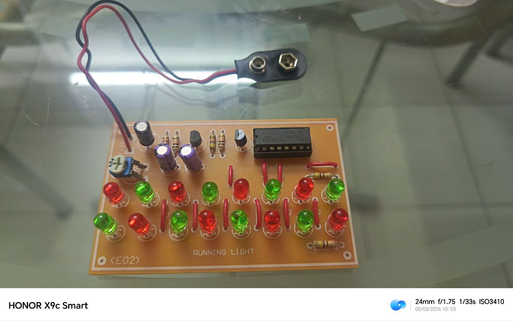
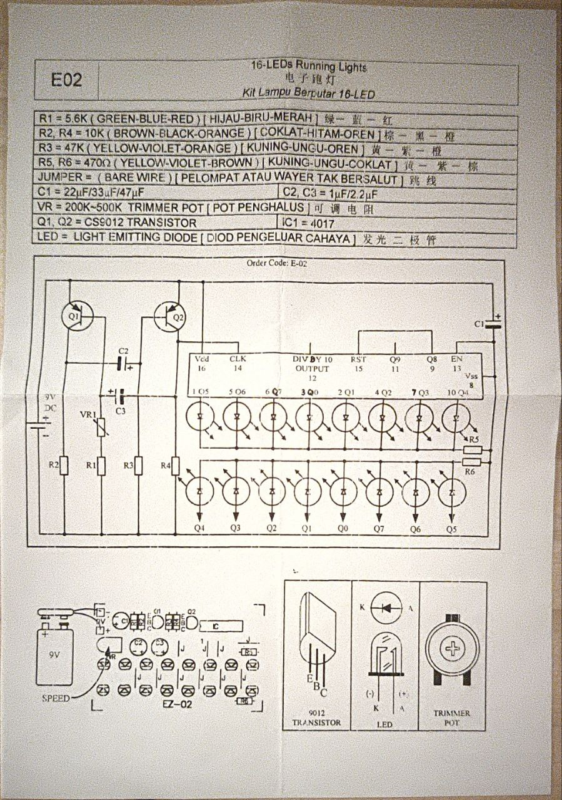

# 16-LED Running Light Circuit

## Overview
This is a simple 16-LED running light circuit hobby kit

## What It Does
The 16 LEDs light up sequentially, creating the effect of two “dots” chasing each other around the circuit

## Images

## Schematic

## What I Learned
- First experience with a trimmer pot (trimmer potentiometer)
- First time using an IC holder and understanding why it's better than soldering the IC directly to the board
- Learned that there are different ways to create an LED running circuit depending on the components used
- Refreshed my understanding of transistors and their functions
- Learned that different IC pins have different purposes
- Still exploring why the circuit is designed this way and the reasoning behind the component values

## Problems & Fixes
> *Note: Before testing, all connections were already checked for shorts.*
1. Only one LED lit up (without blinking) when the power source was connected
2. When attempting to remove the power source, two different LEDs lit up (still without blinking)
3. Reconnecting the battery caused the same single LED from step 1 to light up again. 
4. Removing the power source again made two different LEDs light up (still without blinking)
5. Same situation as step 3 occurred
6. Touching a resistor caused a nearby LED to light up, but it went out when contact stopped
7. Suspected loose solder joints, so carefully inspected the circuit for areas with insufficient solder
8. Added solder to the problematic joints
9. Circuit then worked as intended, with all LEDs running sequentially

## Notes & Thoughts
- Thankful to my secondary school for exposing us to hands-on electronics
- A sense of nostalgia (and a little regret) that I didn’t try pursuing EEE, especially since Computer Engineering wasn’t available
- Still not fully used to debugging hardware... I was panicking when the circuit didn’t work, even though I usually don’t give up so easily with software debugging!
- On to the next project! (or rather, figuring out why my mosquito screamer didn't work...)
